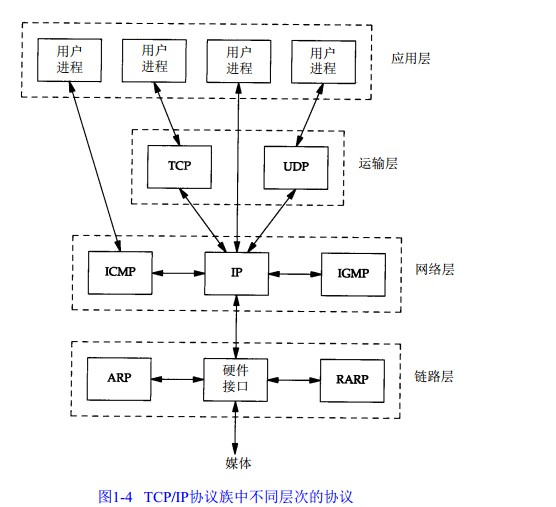
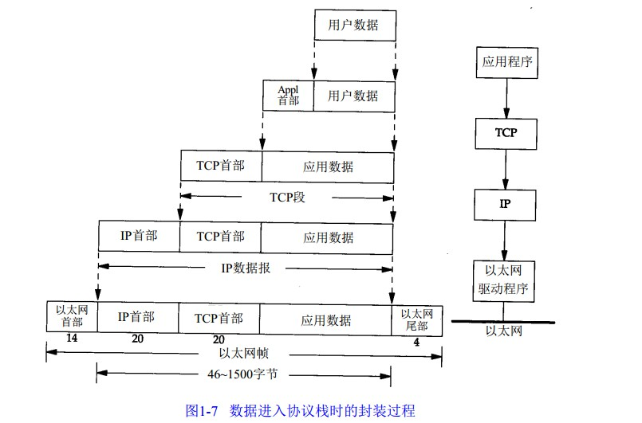
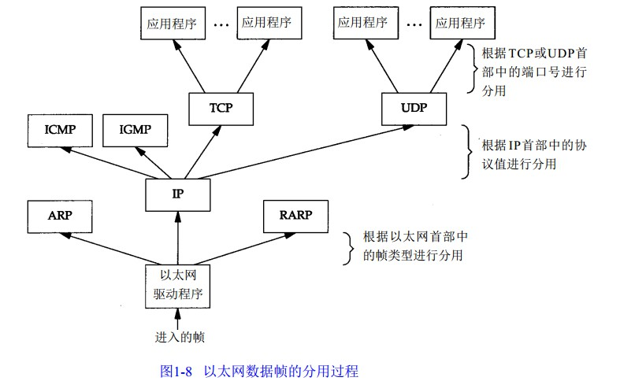

2018-02-02

## 概述

### 分层

1. 链路层
    - 数据链路层或网络接口层
2. 网络层
    - 互联网层
    - 处理分组在网络中的活动
        - 分组的选择
    - IP, ICMP(Internet 互联网控制报文协议), IGMP(Internet组管理协议) 
        - **IP: 点到点的服务**
3. 运输层
    - 为两台主机上的应用程序提供**端到端**的通信
    - TCP
        - 两台主机提供高可靠性的数据通信
        - 主要工作
            - 数据分成合适的小块交给网络层
            - 确认接受到的分组
            - 设置发送最后确认分组的超时时钟
    - UDP
        - 只是包称作数据报的分组从一台主机发送到另一台主机
4. 应用层
    - 负责处理特定的应用程序细节
    - Telnet 远程登录。
    - FTP 文件传输协议。
    - SMTP 简单邮件传送协议。
    - SNMP 简单网络管理协议
5. 理解
    - 网络层IP 提供的是一种不可靠的服务, TCP在之上提供了一个可靠的传输层
    - Mybatis 缓存 装饰器模式

### ICMP
1. IP层用它来与其他主机或路由器交换错误报文和其他重要信息
2. Ping和Traceroute

### IGMP
1. Internet组管理协议。
2. **它用来把一个 U D P数据报多播到多个主机**

### ARP（地址解析协议）和 RARP（逆地址解析协议）
1. 是某些网络接口（如以太网和令牌环网）使用的特殊协议，
2. 用来转换 I P层和网络接口层使用的地址

### 路由器
1. Router
2. **为不同类型的物理网络提供连接**

### TCP在不可靠的IP层提供一个可靠的运输层
1. 超时重传
1. 发送和接受端到端的确认分组等

### 互联网地址
1. IP地址具有一定的结构, 分为五类
2. 区分各类地址的最简单的方法就是看他第一个十进制整数
3. 计算方法(以A类为例)
    - 0 + 7bit 网络号 + 24 为 主机号
    - 0 000 0000 0000 0000 0000 0000 0000 0000 --- 0 111 1111 1111 1111 1111 1111 1111 1111 
    - 0.0.0.0 --- 127.255.255.255 

***

### 封装

1. 每一层对收到的数据都要增加一些首部信息(有时候增加尾部信息)
1. IP 首部
    - 由于TCP、UDP、ICMP和IGMP都要向IP传送数据，因此IP必须在
        生成的IP首部中加入某种标识，以表明数据属于哪一层。为此，IP在首部中存入一个长度为
        8bit的数值，称作协议域。**1表示为ICMP协议，2表示为IGMP协议，6表示为TCP协议，17表
        示为UDP协议**
2. 运输层
    - 生成报文首部时要存入一个应用程序的标识符
    - TCP, UDP 都用一个16bit的端口号来表示不同的应用程序
    
### 分用

1. 协议由下到上, 去掉各个协议加上的报文首部, 
2. 协议确实是通过目的端口号、源 I P地址和源端口号进行解包的。

### 端口号
1. 客户端: 临时端口号

### RFC(Request for Comment)

### 应用编程接口
1. socket
2. TLI(运输层接口 Transport Layer Interface)

### 