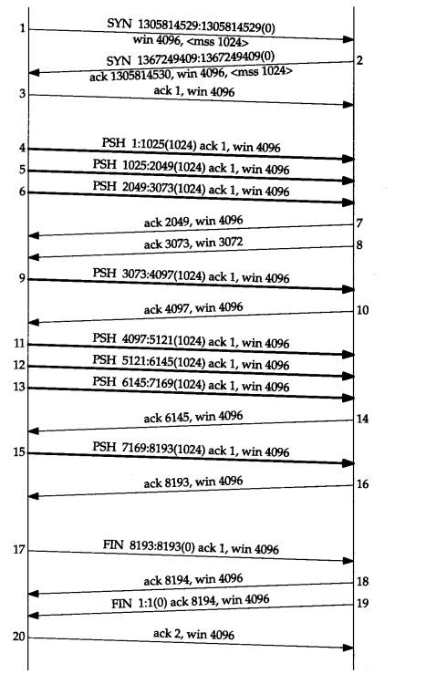
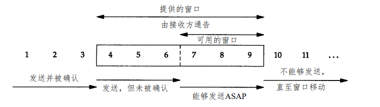
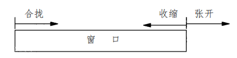
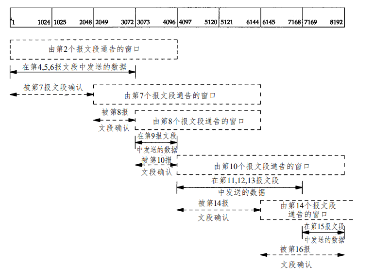

2018-12-10

## TCP 成块数据流

### 正常数据流

### 滑动窗口

### 滑动窗口的动态性

1. 发送方不必发送一个全窗口大小的数据
2. **来自接收端的一个报文段确认数据并把窗口向右移动**
3. 窗口大小可以减小, 但是只能 左边向右边减少
4. **接收方发送一个ACK不必等待窗口被填满**

### 慢启动
1. **用于防止因特网的突然过载和拥塞**
2. 拥塞窗口
    - congestion window
    - 建立连接时, 被初始化为 1 个报文段, 没收到一个ACK, 拥塞窗口就增加一个报文段
    - **发送方去拥塞窗口和通告窗口的最小值最为发送上限**
    - **拥塞窗口是发送方使用的流量控制, 通告窗口是接收方使用的流量控制**
    
### 拥塞
1. 产生原因
    - 数据到达一个大管道 并向一个较小的管道发送时

### 