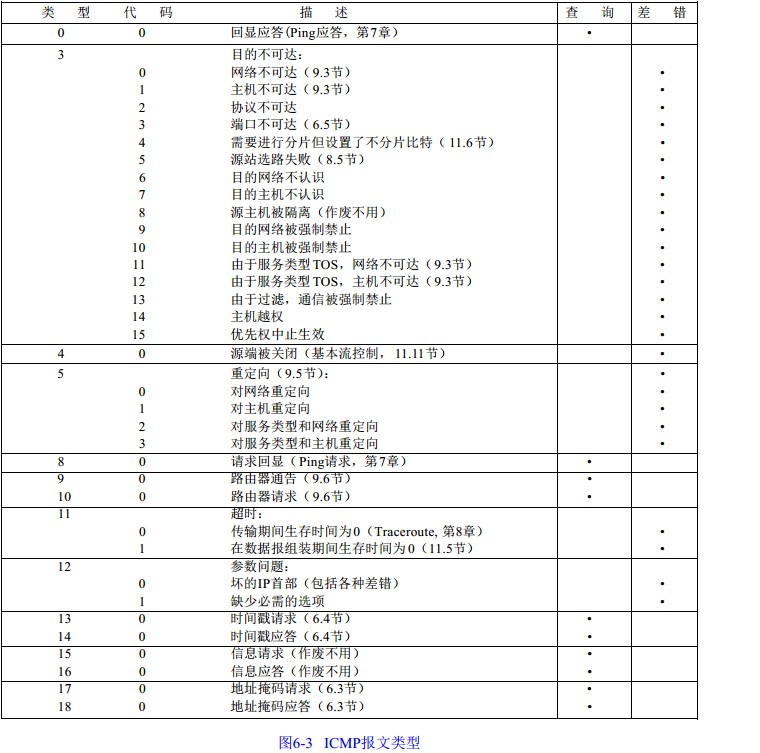
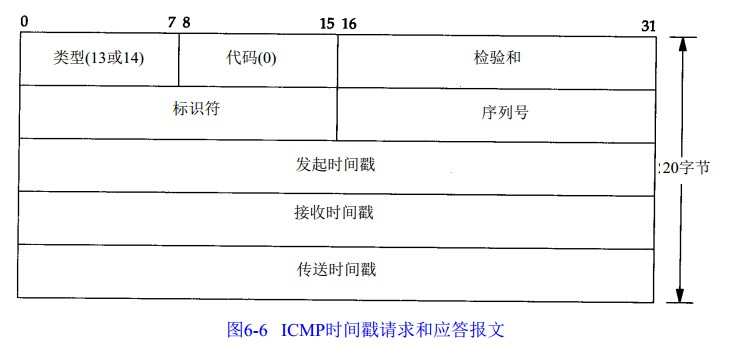

2018-12-04

## ICMP: Internet控制报文协议

### 报文格式
1. 8位类型 + 8位代码 + 16位校验和 + 内容

### 报文类型
1. 在对 ICMP差错报文进行响应时，永远不会生成另一份 ICMP差错报文
    - 防止无限循环

### 时间戳请求和应答
1. 允许系统向另一个系统查询当前的时间
2. 返回的建议值是自午夜开始计算的毫秒数
3. 毫秒级的分辨率
3. **无法获取日期**

### 