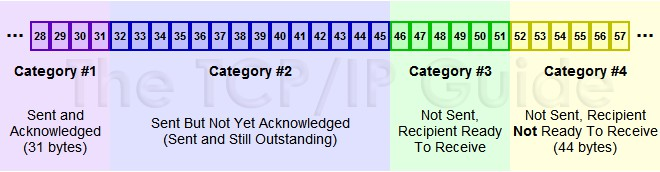
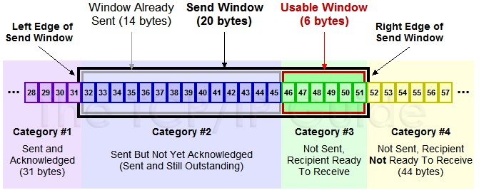
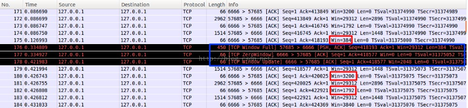

2019-03-19

## 滑动窗口
1. https://blog.csdn.net/wdscq1234/article/details/52444277

### TCP优势
1. 可靠的, 流控的数据传输
2. 如何实现
    - 窗口滑动适应系统
    - 超时重传
    - 累积 ACK

### 引入
1. 为什么
    - 发送端 想多发送几个包, 不必等候ACK, 接收端 一次确认多个
    - 保证顺序性,
    - 对于乱序
        - 先缓存提前到的数据, 然后等待需要的数据, 一定时间没有来, drop

### 概念分类
1. 发送端 
    - send and acked
        - 已发送已被确认, 实际已在窗口以外, 此时窗口已经进行了合拢, 同时打开接收新的待发送的数据
    - send but not yet acked
        - 已发送但没有被确认, 窗口内的数据, 没有收到 ack, 认为没有完成发送. 窗口内数据
    - not send, Recipient Ready to Receive
        - 尽快发送的数据, 已加载到缓存, 窗口中, 等待发送, 是接收方可以接纳的包
    - Not Sent，Recipient Not Ready to Receive
        - 未发送, 接收端也不允许发送, 超出接收端接收的范围
    - 
    
    
2. 接收端
    - Received and ACK Not Send to Process
        - 这部分数据属于接收了数据但是还没有被上层的应用程序接收，也是被缓存在窗口内
    - Received  Not ACK
        - 已经接收并，但是还没有回复ACK，这些包可能输属于Delay ACK的范畴了
    - Not Received
        - 有空位，还没有被接收的数据。
        

### 发送端口 可用端口
1. 发送端口
    - 已经发送了，但是没有收到ACK
2. 可用端口
    - 接收端允许发送但是没有发送的那部分
    -
    
    
### 滑动窗口原理
1. 假设32~45 这些数据，是上层Application发送给TCP的，TCP将其分成四个Segment来发往internet
2. seg1 32~34 seg3 35~36 seg3 37~41 seg4 42~45  这四个片段，依次发送出去，此时假设接收端之接收到了seg1 seg2 seg4
3. 此时接收端的行为是回复一个ACK包说明已经接收到了32~36的数据，并将seg4进行缓存（保证顺序，产生一个保存seg3 的hole）
4. 发送端收到ACK之后，就会将32~36的数据包从发送并没有确认切到发送已经确认，提出窗口，这个时候窗口向右移动
5. 假设接收端通告的Window Size仍然不变，此时窗口右移，产生一些新的空位，这些是接收端允许发送的范畴
6. 对于丢失的seg3，如果超过一定时间，TCP就会重新传送（重传机制），重传成功会seg3 seg4一块被确认，不成功，seg4也将被丢弃
    
    

### 滑动窗口动态调整
1. 主要是根据接收端的接收情况，动态去调整Window Size，然后来控制发送端的数据流量
2. 客户端不断快速发送数据，服务器接收相对较慢，看下实验的结果
    - 包175，发送ACK携带WIN = 384，告知客户端，现在只能接收384个字节
    - 包176，客户端果真只发送了384个字节，Wireshark也比较智能，也宣告TCP Window Full
    - 包177，服务器回复一个ACK，并通告窗口为0，说明接收方已经收到所有数据，并保存到缓冲区，但是这个时候应用程序并没有接收这些数据，
      导致缓冲区没有更多的空间，故通告窗口为0,      这也就是所谓的零窗口，零窗口期间，发送方停止发送数据
    - 客户端察觉到窗口为0，则不再发送数据给接收方
    - 包178，接收方发送一个窗口通告，告知发送方已经有接收数据的能力了，可以发送数据包了
    - 包179，收到窗口通告之后，就发送缓冲区内的数据了
    -
    

