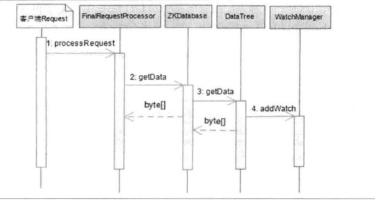

2019-04-21

## Watcher--数据变更通知

### Watcher 接口
1. process(WatchedEvent event);

### Watcher 事件

### 工作机制
1. 客户端注册 Watcher
    - 时机
        - 创建客户端会话
        - getData, getChildraen, exist
    - 封装
        - 对当前请求 的 Watcher 封装成 WatcherRegistration
        - 暂时保存数据节点的路径和Watcher的对应关系
    - Packet
        - Zookeeper 最小的通信单元
        - WatcherRegistration 封装到 Packet
        - 放入发送队列, 等待发送 --> outgoingQueue
    - send
        - 客户端发送
        - sendThread 线程接收响应
    - finishPacket
        - **取出对应的 Watcher 注册到 ZKWatchManager**
    - ZKWatchManager
        - Map<String, Set<Watcher>>
2. 服务端处理 Watcher
    - ServerCnxn 存储
        -
        
        
        - 需要它来返回 Watcher 响应
    - WatcherManager(DataWatches, ChildWatches)
        - watchTable
            - Map<String, Set<Watcher>>
        - watch2Path
            - Map<Watcher, Set<String>>
    - Watcher触发
        - watchManager.triggerWatch(path, EventType)
        - 具体的触发逻辑
            - 封装 WatchedEvent
                - 通知状态(KeeperState)
                - 事件类型(EventType)
                - 节点路径(path)
            - 查询 Watcher
                - watchTable
                - 移除
            - process 触发 Watcher
                - ServerCnxn
                - 请求头(-1)

3. 客户端回调 Watcher
    - SendThread 接收事件通知
    - 步骤
        - 反序列化 --> WatcherEvent
        - 处理 ChrootPath
        - 还原 WatchedEvent
        - 回调 Watcher
    - EventThread 处理事件通知
        - 入队
        - ZkWatchManager 取出 Watches
        - 回调

### 特性总结
1. 一次性
    - 无论客户端还是服务端, 触发一次就移除
    - **需要反复注册, 有效减轻服务器压力**
    - 但是对于一直有效的 Watcher, 特别是更新频繁的节点, 对服务端性能影响较大
2. 客户端串行
    - **保证顺序**
    - **不要因为 一个 Watcher 的逻辑影响整个客户端的回调**
3. 轻量
    - 值告诉客户端发生了事件, 但没有事件的具体内容
    - 降低 网络开销以及服务器内存开销