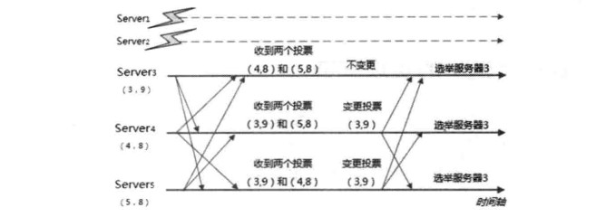

2019-04-24

## Leader 选举
1. 选举概述
2. 算法分析
3. 实现细节

### 选举概述
1. 集群规模 >= 2
1. 服务器启动时期的 Leader 选举
    - 每个Server 会发出一个投票
        - 都会将自己作为 Leader 进行投票
        - (mysid, Zxid)
        - 2台机器: (1,0), (2,0)
    - 接收来自各个服务器的投票
        - 判断投票的有效性
            - **是否是本轮投票**
            - 是否来自 Looking 状态的服务器
    - 处理投票
        - PK规则
            - ZXID 大的服务器优先作为 Leader
            - ZXID 一样, mysid 大的作为 Leader
        - 此时
            - mysid=1的服务器更新投票-->(2, 0)
            - mysid=1重新投票
            - mysid=2不更改投票, 只是重新发送投票信息
    - 统计投票
        - **是否有过半的机器收到相同的投票**, >= (n/2+1)
    - 改变服务器状态
        - 一旦确定 Leader, 
        - Follower --> Following
        - Leader --> Leading
2. 服务器运行期间的Leader选举(如果 Leader 还活着, 即使非leader宕机了或者新节点的加入, 都不会影响 Leader)
    - 类似

### 算法分析
1. TCP的 FastLeaderElection
1. leader 不存在的 Leader 选举
    - 开始第一次投票
        - Looking
        - (sid, zxid)
        - (1,2,3,4,5), (9,9,9,8,8)
        - 1,2所在机器出现故障,
        - **第一次都投给自己**
        - 3,4,5 --> (3,9), (4,8), (5,8)
    - 变更投票
        - vote_sid, vote_zxid
        - self_sid, self_zxid
        - vote_sid > self_zxid --> 认可投票, 发送 (vote_sid, vote_zxid)
        - vote_sid < self_zxid --> 不变
        - vote_sid = self_zxid, vote_sid > self_zxid --> 认可投票, 发送 (vote_sid, vote_zxid)
        - vote_sid = self_zxid, vote_sid <= self_zxid --> 不变
        - 
        
        
    - 确定Leader
        - server3 为 Leader
    
### 实现细节
1. 服务器状态
    - Looking: 认为没有Leader, 进入 Leader选举状态
    - Following: Follower
    - Leading: Leader
    - **Observing: Observer, 观察者, 处理非事务请求, 不参与投票, 缓解查询压力**
2. 投票数据结构
    - id: sid
    - zxid
    - electionEpoch: 选举周期, 递增+1
    - peerEpoch: Leader的 epoch
    - state: 服务器状态
3. QuorumCnxManager
    - 每台服务器启动的时候, 都会启动 QuorumCnxManager
    - 负责服务器之间底层Leader 选举过程中的网络通信
    - 组成
        - recvQueue: 保存接收到的队列
        - queueSendMap: 待发送的队列
            - 根据sid 分组, 为集群中每台机器分配一个单独的队列
        - sendWorkerMap: 消息的发送器
        - lastMessageSent
    
        