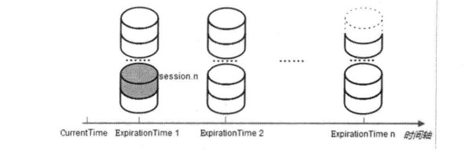

2019-04-22

## 会话
1. 临时节点的生命周期
2. 客户端请求的顺序执行
3. Watcher 通知机制

### 会话状态
1. Connecting <--> Connected
2. **从服务器列表中逐个选取 IP 地址尝试进行网络连接**
3. 自动重连

### 会话创建
1. Session
    - Sessionid
        - 唯一标识一个会话
        - 创建时, Zookeeper 分配
    - TimeOut
        - 会话超时时间
        - 客户端配置
        - 服务器根据自己的超时时间最终确定会话的超时时间
        - **也就是说, 每个Session 的超时时间会不一样**
    - TickTime
        - **下次会话的超时时间**
        - 对会话实行 **分桶策略** 管理
        - 高效低耗的实现会话的超时检测与清理
    - isClosing
        - 不处理来自此会话的新情求
2. SessionID
    ```java
    public class SessionTrackerImpl{
            public static long initializeNextSession(long sid) {
                long nextSid = 0;
                nextSid = (System.currentTimeMillis() << 24) >>> 8;
                nextSid =  nextSid | (sid <<56);
                return nextSid;
            }
    }
    
    ```
    - 全局唯一
    - server 实现
    - 步骤(高8位确定所在机器, 后56位使用当前时间的毫秒表示 **随机**)
        - 当前时间的毫秒数
        - 左移24
            - 高24位移除
            - 低24位补0
            - 为什么
                - 时最高位为0, 防止负数的出现, 无法是高8位表示 sid
                - 但
        - **无符号右移 8**
            - 不管正负, 高位补0
            - 为什么不是 右移8位
                - 防止出现负数, 避免高位数值对 sid 的干扰
        - sid
            - nextSid | (sid <<56)
            - 高8位标识 sid

3. SessionTracker
    - 负责 会话创建, 管理, 清理
    - 每一个会话在 SessionTracker 保留三分
        - sessionByid
            - HashMap<Long, SessionImpl>
        - sessionsWithTimeout
            - ConcurrentHashMap<Long(Sessionid), Integer(sessionTimeout)>: 
        - sessionSets
            - HashMap<Long(expireTime), SessionSet>
4. 创建连接
    - ConnectRequest请求
        - NioServerCnxn
        - 超时时间协商
    - 会话创建
        - sessionid
        - sessionByid
        - sessionsWithTimeout
    - 处理器链路处理
    - 会话响应

### 会话管理
1. 分桶策略
    - 类似的会话放在同一个区块进行管理
    - **便于 Zookeeper 对会话进行不同区块的隔离处理 以及 统一处理**
    - 
    
2. ExpiratiionTime_1
    - ExpiratiionTime = CurrentTime + SessionTimeout
    - 不方便服务器进行定时会话超时检查, 因为都会一样, 没有一个固定的间隔
3. ExpiratiionTime_2
    - 固定间隔 tickTime
    - ExpiratiionTime_tmp = CurrentTime + SessionTimeout
    - ExpiratiionTime = (ExpiratiionTime_tmp / tickTime + 1) * tickTime
    - 使 ExpiratiionTime 总是 tickTime 的整数倍
    - **这样就可以选择一个固定的 时间间隔 进行 会话超时检查**
    - 高效低耗
3. 会话激活
    - 超时会话激活
    - 计算 ExpiratiionTime_New
    - 根据 ExpiratiionTime_Old 定位老的会话所在区块
    - 会话迁移
1. 会话超时检查
    - 一个单独线程
1. 会话清理
    - TODO

### 重连
1. TODO
            
    