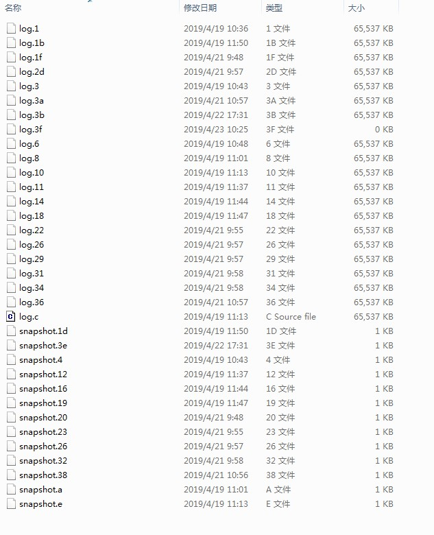

2019-04-12

## 思考
1. Zookeeper 是一个什么系统****
1. Zookeeper 解决什么问题
1. 分布式锁
    - 排它锁
        - 如何解决 我创建锁最后只会由我来删除
            - Version ? 
2. PrepRequestProcessor 是多线程的吗
    - 应该不是, 处理内部都没有加锁
    - TODO
1. processer 链条
    - 常用
        - PreRequestProcessor --> SyncRequestProcessor --> FinalRequestProcessor
    - 有什么好处吗
1. 一致性如何保证的? 也就是说 什么时候写本地日志
    - TODO
2. 客户端错误是如何返回的锁
    - TODO
3. Watcher 具体实现
    - TODO
    - 为什么在触发 Watcher 之后, 不降修改后的数据直接给客户端, 而需要客户端主动请求
        - 既然注册了 Watcher, 说明客户端对这个节点的变化感兴趣啊
        - TODO
1. 理解 惊群效应 
    - 大量Watcher 一个时间点一起触发
    - 锁优化
1. Watcher 实体会发送到 服务器吗
    - 不会
    - 只是一个标记位
    - 追求简单
1. 为什么会话管理采用 分桶策略
    - 自己: 会话超时时间不一致
1. 投票过程中如果一直没有收到过半投票怎么办
    - 一直继续投吗?
    - 下一个任期 继续投票
1. 如何保证数据一致性
    - TODO
2. 在测试环境中, 事务日志文件很多, 多到
    -
    
    
    - 服务器启动完成需要进行第一次事务日志的写入
    