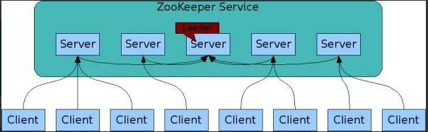

2019-04-15

## Zookeeper

### Zookeeper 是什么
1. **分布式**,  **协调**,  服务
2. 在分布式系统中 共享配置, 协调锁资源, 提供命名服务

### 数据模型
1. 像 数据结构中的数, 像 文件系统的目录
2. Znode
    - 树是由节点所组成，Zookeeper的数据存储也同样是基于节点，
    - 每一个 Znode 节点拥有唯一路径, 对不同的信息作出清洗的隔离
    - 包含
        - data: 数据
        - child: 子节点的引用
        - ACL: 访问权限
        - stat: 状态
            - 事务ID
            - 版本号
            - 时间戳
            - 等

### 基本操作和事件通知
1. 基本操作
    - create: 创建节点
    - delete: 删除节点
    - exists: 判断节点是否存在
    - getData: 获得一个节点的数据
    - setData: 设置一个节点的数据
    - getChildren: 获取节点下的所有子节点
    - exists，getData，getChildren属于读操作。**Zookeeper客户端在请求读操作的时候，可以选择是否设置Watch**
2. 事件通知
    - 可以理解成是注册在特定Znode上的触发器
    - 这个Znode发生改变，也就是调用了create，delete，setData方法的时候，将会触发Znode上注册的对应事件，
        **请求Watch的客户端会接收到异步通知**。
    - 过程
        - 客户端 getData(Watc:true)
        - Znode 删除, server 查找 hash, 异步通知, 删除 key-value
          
### Zookeeper的一致性 -- 集群

1. 一主多从
2. 更新数据, 首先更新主节点, 再同步从节点
3. 在读取数据时，直接读取任意从节点
4. 为了保证主从节点的数据一致性，**Zookeeper采用了ZAB协议**，这种协议非常类似于一致性算法Paxos和Raft。

### 使用场景
1. 读多写少的场景所设计
2. Znode并不是用来存储大规模业务数据，而是用于存储少量的状态和配置信息，每个节点的数据最大不能超过1MB。
3. 具体
    - 分布式锁: 临时顺序节点
    - 服务注册与发现: Znode + Watch
    - 共享配置和状态信息: 依靠Zookeeper同步节点信息，实现高可用。 
        - Kafka
        - HBase
        - Hadoop